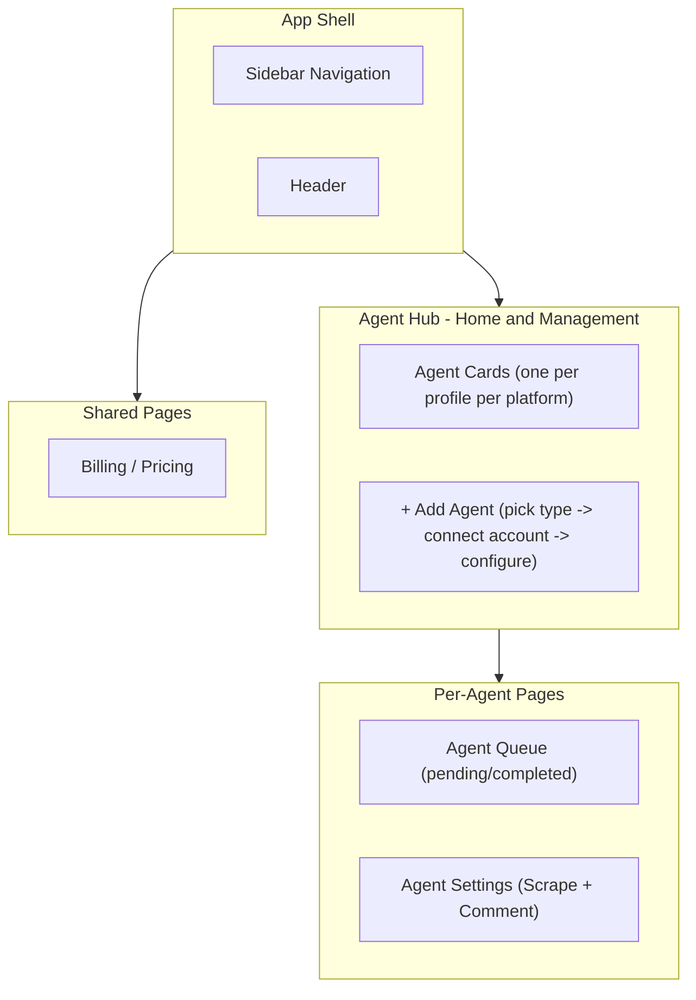
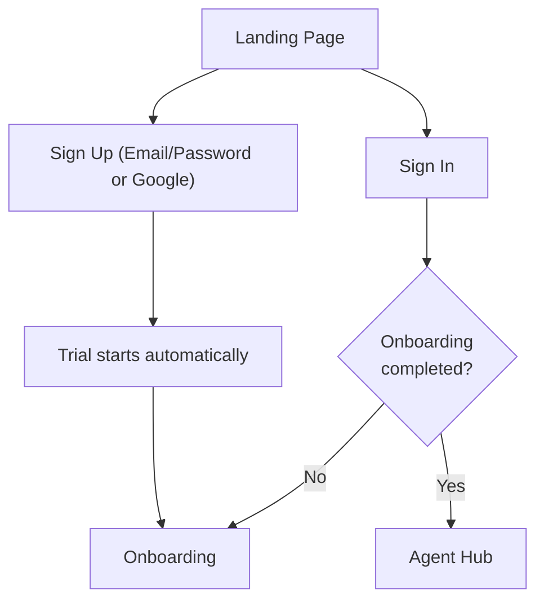
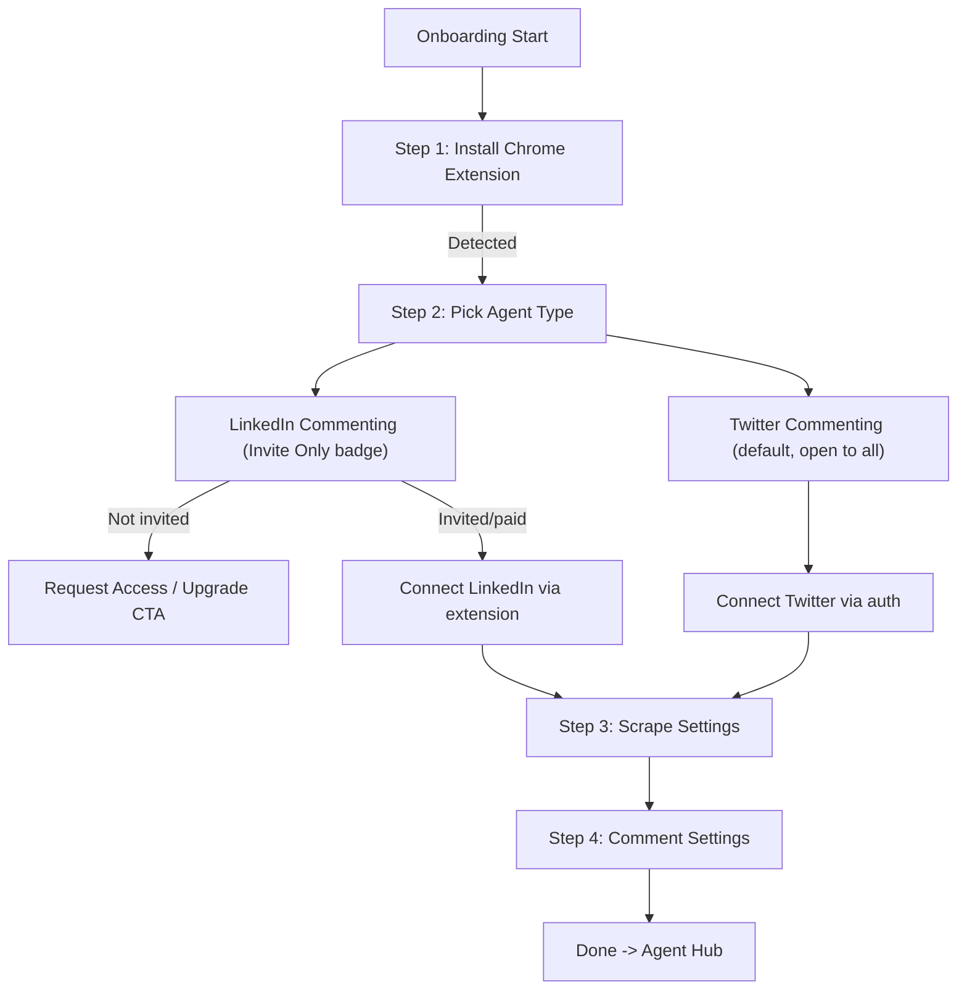
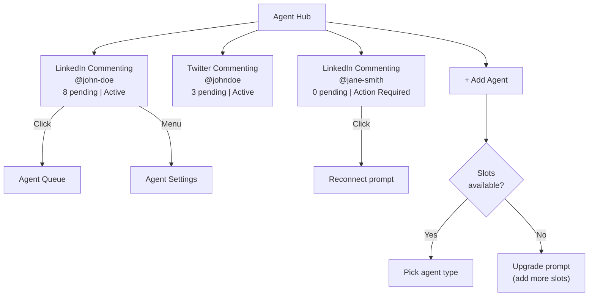
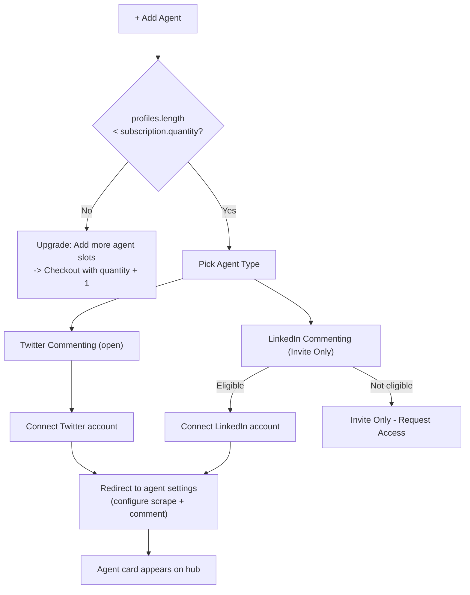
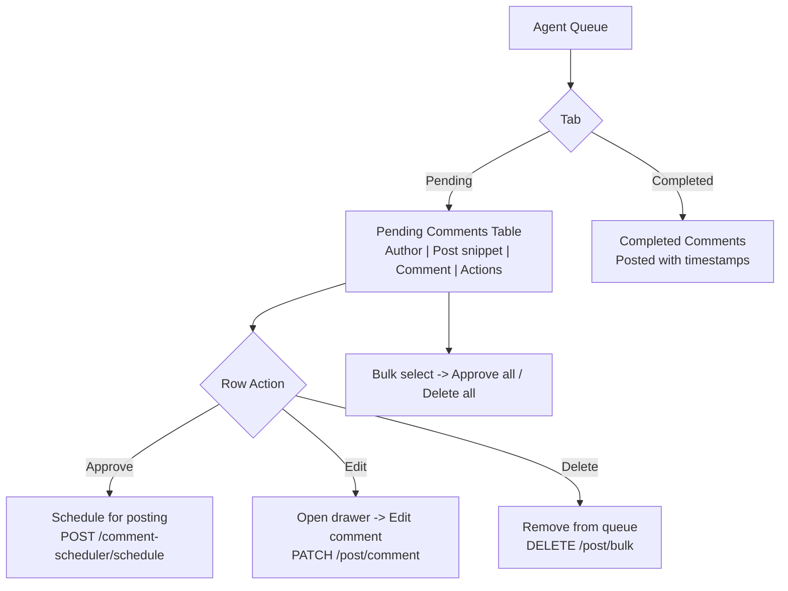
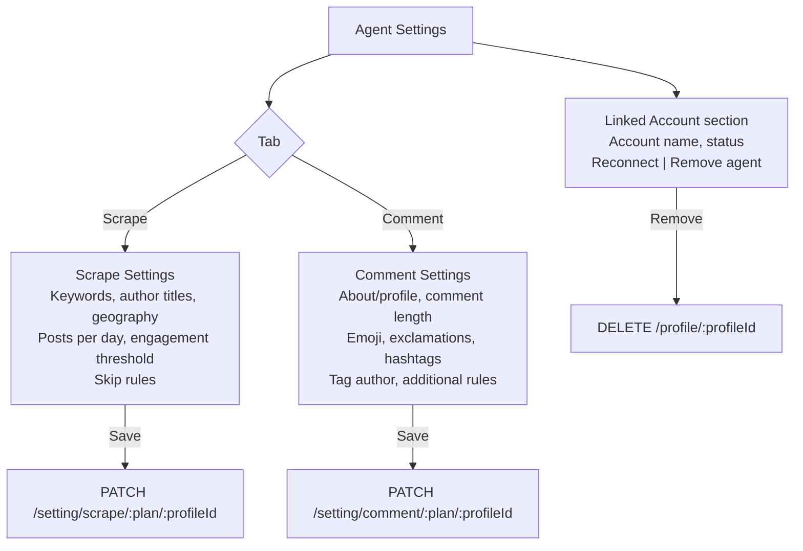
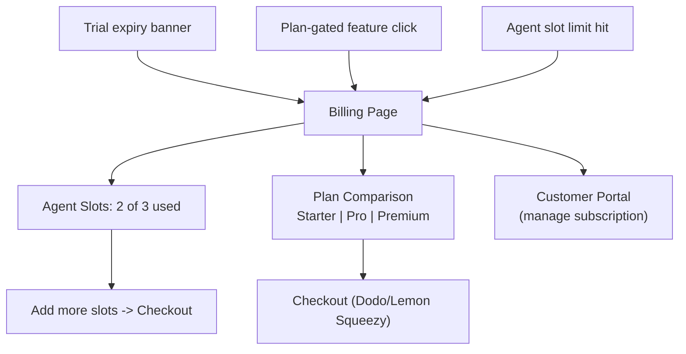
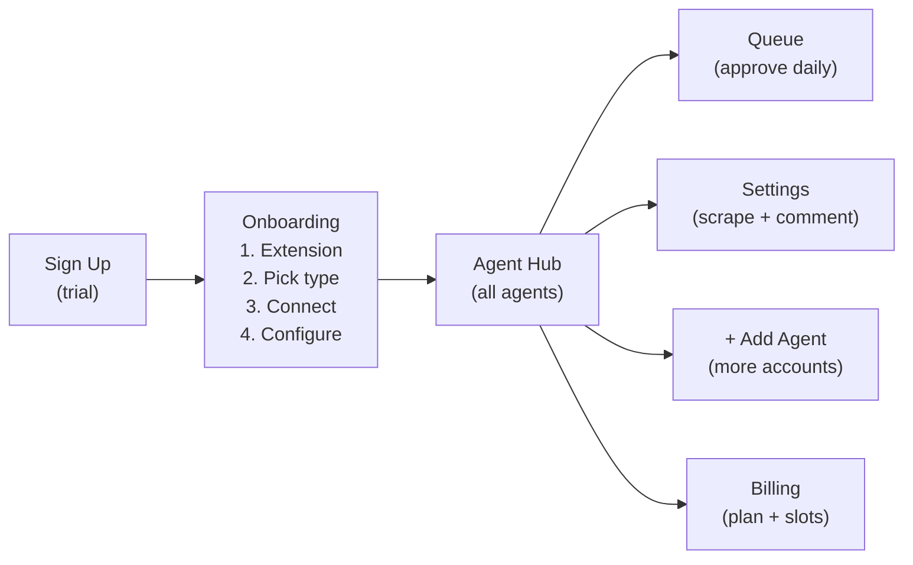

# Agent System Dashboard Redesign

## Key Decisions

- **Frontend-only**: No backend changes. The backend continues to operate on `profileId`. The "agent" concept is a frontend abstraction.
- **One agent per profile per platform**: A LinkedIn profile gets one LinkedIn Commenting agent. A Twitter profile gets one Twitter Commenting agent. This maps 1:1 to how the backend already stores settings.
- **Agents are derived, not persisted**: An "agent" = `{ profileId + agentType + settings (from API) + queue (from API) }`. No new backend entity needed.
- **Agent-first management**: No separate "Profile Management" page. The Agent Hub is the management view. Profiles are an attribute of agents, not standalone entities. "Add agent" = pick type -> connect social account -> configure.
- **Separate scrape + comment settings per agent**: Each commenting agent's settings page has two sections: Scrape Settings (targeting, keywords, filters, schedule) and Comment Settings (style, length, emoji, rules). Same split as today, just moved under the agent.
- **LinkedIn is invite-only**: LinkedIn Commenting is a premium/invite-only agent type. Only paid/invited customers can use it. Twitter Commenting is the default, open-to-all option. Onboarding and Add Agent flows guide users accordingly.
- **Quantity-based billing**: Each subscription has a `quantity` (default 1) representing the max number of agents. Trial users get exactly 1 agent slot -- to add more agents, they must upgrade and purchase additional slots via checkout. The backend enforces this via `checkSubscriptionLimit` in `ProfileService`.

## Current State

The dashboard is a LinkedIn-first commenting tool with:

- **Onboarding**: extension install -> LinkedIn connect -> post settings -> comment settings -> identity
- **Core pages**: Dashboard (stats), History (pending/completed queue), Settings (post + comments)
- **Twitter**: Backend exists but no dedicated UI; shares the same History page
- **No agent concept**: Everything is monolithically tied to a single LinkedIn profile

Key files: routes in `src/routes/`, features in `src/features/`, sidebar in `src/components/layout/sidebar-data.ts`, stores in `src/stores/`

---

## Target Architecture




### Core Concepts

- **Agent Type**: A frontend-only template (e.g., "LinkedIn Commenting", "Twitter Commenting"). Defined in a registry with metadata: icon, description, platform, access level, scrape settings component, comment settings component, queue columns.
- **Derived Agent**: Not a persisted entity. Computed from `profiles + agentType`. When a user adds a LinkedIn Commenting agent and connects a LinkedIn account, the agent card appears on the hub. The agent's ID is simply `{profileId}-{agentType}` (e.g., `abc123-linkedin-commenting`). The linked social account (profile) is an attribute of the agent, not a standalone entity.
- **Agent Type Registry**: A frontend config that maps agent types to their UI components. Adding a new agent type means registering it with its components -- no restructuring needed.

### How Agents Map to Backend


| Frontend concept          | Backend reality                                                                                         |
| ------------------------- | ------------------------------------------------------------------------------------------------------- |
| LinkedIn Commenting agent | `profileId` + `/post/pending/:profileId` + `/setting/scrape/:profileId` + `/setting/comment/:profileId` |
| Twitter Commenting agent  | `profileId` + `/post/pending/:profileId` (filtered by platform) + twitter scrape/comment settings       |
| Agent queue               | Existing `/post/pending/:profileId` and `/post/completed/:profileId` endpoints                          |
| Agent settings            | Existing `/setting/scrape/:profileId` and `/setting/comment/:profileId` endpoints                       |


---

## Phase 1: Agent System Infrastructure

### 1a. Agent Type Registry

Create a registry pattern so adding a new agent type is declarative:

```typescript
// src/features/agent-system/registry.ts
interface AgentTypeDefinition {
  slug: string;                       // 'linkedin-commenting'
  name: string;                       // 'LinkedIn Commenting'
  description: string;
  icon: ComponentType;
  platform: 'linkedin' | 'twitter';
  access: 'open' | 'invite-only';    // Controls visibility in Add Agent flow
  badge?: string;                     // e.g. 'Invite Only', 'Premium'
  isEligible?: (user: IUser) => boolean; // Runtime check (PostHog flag + plan check)
  scrapeSettingsComponent: ComponentType;
  commentSettingsComponent: ComponentType;
  queueColumns: ColumnDef[];
  queueItemComponent: ComponentType;
}

const AGENT_TYPES: Record<string, AgentTypeDefinition> = {
  'linkedin-commenting': {
    // ...
    access: 'invite-only',
    badge: 'Invite Only',
  },
  'twitter-commenting': {
    // ...
    access: 'open',
  },
};
```

### 1b. Derived Agent Logic

Agents are computed from profiles, not stored:

```typescript
// src/features/agent-system/hooks/use-agents.ts
function inferPlatform(profile: IProfile): 'linkedin' | 'twitter' {
  // In DB, only Twitter profiles have platform='twitter' explicitly
  // LinkedIn profiles may not have the field (defaults in schema)
  return profile.platform === 'twitter' ? 'twitter' : 'linkedin';
}

function useAgents() {
  const profiles = useGetAllProfiles();
  
  return profiles.flatMap(profile => {
    const platform = inferPlatform(profile);
    if (platform === 'linkedin') {
      return [{
        id: `${profile._id}-linkedin-commenting`,
        type: 'linkedin-commenting',
        profileId: profile._id,
        profileName: `${profile.firstName} ${profile.lastName}`,
        status: profile.status,
      }];
    }
    if (platform === 'twitter') {
      return [{
        id: `${profile._id}-twitter-commenting`,
        type: 'twitter-commenting',
        profileId: profile._id,
        profileName: profile.screenName || `${profile.firstName} ${profile.lastName}`,
        status: profile.status,
      }];
    }
    return [];
  });
}
```

### 1c. Replace `activeProfile` Pattern

The current global `useProfileStore.activeProfile` pattern must be replaced with route-param-based scoping:

- Create `useCurrentAgent()` hook: reads `profileId` and `agentType` from TanStack Router route params, looks up the profile from the profiles query, and returns the derived agent with its profile data.
- Inside agent pages (`/agents/:profileId/:agentType/*`): all queries use `profileId` from route params via `useCurrentAgent()`.
- Outside agent pages (hub, billing): no active profile needed; the hub fetches summary stats for all profiles.
- Update `IProfile` to include: `platform?: 'linkedin' | 'twitter'`, `twitterUserId?: string`, `screenName?: string`.
- Gradually remove `useProfileStore` imports across 11+ files as each feature is migrated to agent-scoped pages.

### 1d. New Route Structure

```
/(auth)/*                              -- unchanged
/onboarding/*                          -- redesigned (Phase 6)
/_authenticated/
  /                                    -- Agent Hub (home + management)
  /agents/:profileId/:agentType        -- Agent detail layout
  /agents/:profileId/:agentType/queue  -- Agent Queue
  /agents/:profileId/:agentType/settings -- Agent Settings (Scrape + Comment tabs)
  /billing                             -- Billing / Pricing
```

Route params use `profileId` + `agentType` instead of an `instanceId`, since agents are derived. This keeps the URL structure aligned with backend API calls (which need `profileId`).

Key route files to create under `src/routes/_authenticated/`:

- `index.tsx` (repurpose as Agent Hub + management)
- `agents/$profileId/$agentType/route.tsx` (agent layout with tabs)
- `agents/$profileId/$agentType/queue.tsx`
- `agents/$profileId/$agentType/settings.tsx`

Files to remove/repurpose:

- `_authenticated/history/` (queue moves into per-agent pages)
- `_authenticated/settings/comments.tsx` and `settings/post.tsx` (moved into per-agent settings as Scrape + Comment tabs)

### 1e. Sidebar Redesign

Current sidebar ([sidebar-data.ts](commentify-dashboard/src/components/layout/data/sidebar-data.ts)):

```
Stats, History, Settings > (Post, Comments), Pricing, Help Center
```

New sidebar structure:

```
Agent Hub (home icon)
My Agents (dynamic, derived from profiles)
  - LinkedIn Commenting - [Account Name] (with status dot)
  - LinkedIn Commenting - [Account Name 2]
  - Twitter Commenting - [Account Name]
  - + Add Agent
---
Billing
```

The "My Agents" section is dynamically built from the derived agents list. Each entry shows agent type + linked account name. Clicking an agent navigates to `/agents/:profileId/:agentType/queue`. When inside an agent, a top tab bar shows Queue / Settings. The "+ Add Agent" button triggers the add-agent flow (pick type -> connect account -> configure).

---

## Phase 2: Agent Hub (Home + Management)

Replace the current dashboard ([features/dashboard/index.tsx](commentify-dashboard/src/features/dashboard/index.tsx)) with an Agent Hub that doubles as the agent management page:

- **Grid of Agent Cards**: Each card derived from profiles. Shows agent type icon, linked account name/avatar, status badge, key stat (e.g., "12 pending comments").
- **"+ Add Agent" card**: Triggers the add-agent flow: pick agent type -> connect a new social account -> configure settings. The profile connection (extension flow for LinkedIn, auth for Twitter) happens as part of adding the agent.
- **Empty state**: For new users with no agents, welcoming prompt with "Add your first agent" CTA.
- **Card click**: Navigates to `/agents/:profileId/:agentType/queue`.
- **Card actions**: Quick menu with settings, reconnect account, remove agent (disconnects the profile).
- Stats on each card come from existing API calls: pending post count from `/post/pending/:profileId`, LinkedIn stats from `/li-stats/:profileId`.

### Add Agent Flow (within the hub)

1. User clicks "+ Add Agent"
2. **Slot check**: Frontend checks `profiles.length` vs `subscription.quantity`. If at limit, show upgrade prompt: "You've used all your agent slots. Add more slots to create another agent." CTA goes to checkout with `quantity + 1` (uses existing `POST /subscription/checkout` with `quantity` param). After purchase, webhook updates `subscription.quantity` and user can proceed.
3. **Pick agent type**: Modal/dialog showing available types:
  - **Twitter Commenting** -- open to all, prominently featured
  - **LinkedIn Commenting** -- shown with "Invite Only" badge. Disabled for non-invited users with messaging: "Our most powerful agent -- available by invitation for paid customers." Invited/paid users can select it.
4. **Connect account**: Platform-specific account connection (LinkedIn via extension, Twitter via auth). This calls the existing `POST /profile/link` endpoint. The backend's `checkSubscriptionLimit` is the final guard.
5. **Configure**: Redirect to the new agent's settings page (`/agents/:profileId/:agentType/settings`) to set up scrape + comment settings.
6. Agent card appears on the hub.

---

## Phase 3: Per-Agent Pages

Each agent gets two sub-pages with a shared agent layout (header with agent type icon, profile name, status, tab navigation for Queue / Settings):

### 3a. Agent Queue (`/agents/:profileId/:agentType/queue`)

- Migrate the existing History feature ([features/history/](commentify-dashboard/src/features/history/)) into per-agent queues.
- Tabs: Pending / Completed (same pattern as current).
- Column definitions come from the agent type registry (LinkedIn posts show LinkedIn URLs, Twitter posts show tweet links).
- Bulk approve/reject/delete actions remain the same -- same API calls, just scoped by the `profileId` from route params.
- The `PostCommentDrawer` is wrapped by a generic drawer that delegates to the type-specific component from the registry.
- API calls stay the same: `/post/pending/:profileId`, `/post/completed/:profileId`, `/comment-scheduler/schedule`, `/post/bulk` (delete).

### 3b. Agent Settings (`/agents/:profileId/:agentType/settings`)

Settings page per agent with two tabs/sections (same split as today, just scoped to the agent):

- **Scrape Settings tab**: targeting config -- keywords, author titles, geography, posts per day, engagement threshold, skip rules. API: `/setting/scrape/:plan/:profileId`
- **Comment Settings tab**: comment style -- about, comment length, emoji, exclamations, hashtags, tag author, additional rules. API: `/setting/comment/:plan/:profileId`
- **Linked account section**: Shows the connected social account, reconnect button if expired, remove agent button (disconnects profile via `DELETE /profile/:profileId`).

---

## Phase 4: Register Agent Types

### 4a. LinkedIn Commenting

- Extract scrape settings form from [features/settings/post/](commentify-dashboard/src/features/settings/post/) -> `features/linkedin-commenting/components/scrape-settings-form.tsx`
- Extract comment settings form from [features/settings/comments/](commentify-dashboard/src/features/settings/comments/) -> `features/linkedin-commenting/components/comment-settings-form.tsx`
- Extract history columns from [features/history/components/columns.tsx](commentify-dashboard/src/features/history/components/columns.tsx) -> `features/linkedin-commenting/components/queue-columns.tsx`
- Register in `AGENT_TYPES` registry

### 4b. Twitter Commenting

- Create new settings forms (currently backend-only, no dashboard UI)
- Create queue columns for Twitter posts (tweet URLs instead of LinkedIn URLs)
- Register in `AGENT_TYPES` registry

---

## Phase 5: Billing / Pricing

### Billing (`/billing`)

- Merge current [billing](commentify-dashboard/src/features/billing/) and [pricing](commentify-dashboard/src/features/pricing/) into one page or keep as sub-routes

**Quantity-based agent slots:**

- Show current usage: "2 of 3 agent slots used" (derived from `profiles.length` / `subscription.quantity`)
- "Add more slots" button -> triggers checkout with `quantity + 1` via `POST /subscription/checkout` with `quantity` param
- When a user tries to add an agent but is at their limit (from the hub), they're directed here

**Plan selection:**

- Starter / Pro / Premium tiers with feature comparison (plan-gated features like geography, author titles, engagement threshold, custom rules)
- Monthly/yearly toggle
- Checkout via Dodo Payments or Lemon Squeezy
- Customer portal link for existing subscribers

**How it works with the backend:**

- `subscription.quantity` is the source of truth for agent slot limits
- Quantity changes only happen through checkout or payment provider portal/webhook
- Backend's `ProfileService.checkSubscriptionLimit` is the final guard when creating profiles
- No backend changes needed -- the frontend just needs to check `profiles.length` vs `subscription.quantity` before initiating the add-agent flow

Note: there is no standalone profile management page. Profiles (social accounts) are managed as part of their agents -- connecting happens during "Add Agent", reconnecting and removing happens in agent settings.

---

## Phase 6: Onboarding Redesign

Current 5-step onboarding is LinkedIn-specific. Simplify to be agent-agnostic:

**New flow:**

1. **Install Extension** - Keep this step (required for scraping). Same as current.
2. **Add First Agent** - Agent type picker with LinkedIn/Twitter positioning:
  - **Twitter Commenting** is prominently featured as the default: "Get started with Twitter commenting -- connect your account and start engaging."
  - **LinkedIn Commenting** shown with "Invite Only" / "Premium" badge: "Our most powerful agent. LinkedIn commenting is available by invitation for paid customers." For non-invited users, show a "Request Access" or "Upgrade to unlock" CTA. For invited/paid users, they can select it.
  - User picks a type -> connects the social account -> configures scrape + comment settings (reuses forms from Phase 4).
3. **Done** - Redirect to Agent Hub showing the newly created agent.

Key changes:

- The onboarding guides users toward Twitter first; LinkedIn is positioned as a premium/invite-only upgrade
- Remove separate post-settings and comment-settings onboarding steps (reuse the agent's scrape + comment settings forms from Phase 4)
- The "identity" (how did you hear about us) step moves to a post-onboarding modal or is removed
- `useOnboardingRedirect` simplified to track: `extension_installed` -> `first_agent_added` -> `completed`

---

## New Feature Directory Structure

```
src/features/
  agent-system/                    # Core agent infrastructure
    types/
      agent.types.ts               # DerivedAgent, AgentType interfaces
    registry.ts                    # Agent type definitions and AGENT_TYPES map
    components/
      agent-card.tsx               # Card for Agent Hub grid
      agent-layout.tsx             # Shared layout for agent detail pages (tabs)
      agent-queue.tsx              # Generic queue that uses registry for columns
      agent-queue-item-drawer.tsx  # Generic drawer delegating to type-specific
    hooks/
      use-agents.ts                # Derive agents from profiles
      use-current-agent.ts         # Current agent from route params

  agent-hub/                       # Agent Hub home page
    components/
      agent-grid.tsx
      empty-state.tsx
    index.tsx

  linkedin-commenting/             # LinkedIn commenting agent type
    components/
      scrape-settings-form.tsx     # (migrated from settings/post)
      comment-settings-form.tsx    # (migrated from settings/comments)
      queue-columns.tsx            # (migrated from history/columns)
      connect-account.tsx          # LinkedIn extension-based connection flow
    register.ts                    # Registers this type in AGENT_TYPES

  twitter-commenting/              # Twitter commenting agent type
    components/
      scrape-settings-form.tsx
      comment-settings-form.tsx
      queue-columns.tsx
      connect-account.tsx          # Twitter auth-based connection flow
    register.ts

  # Existing features that stay mostly unchanged:
  auth/
  billing/
  credits/
  pricing/
  subscription/
```

---

## Implementation Risks & Gaps

### Risk 1: Frontend `IProfile` missing `platform` field

The backend Profile schema has `platform: PlatformEnum` but the frontend `IProfile` ([profile.interface.ts](commentify-dashboard/src/features/users/interface/profile.interface.ts)) doesn't include it. In the DB, only Twitter profiles explicitly have `platform: 'twitter'`; LinkedIn profiles may not have the field (defaults to LINKEDIN in schema).

**Fix**: Update `IProfile` to include `platform?: 'linkedin' | 'twitter'`. In `useAgents()`, infer platform: if `profile.platform === 'twitter'` -> Twitter agent; otherwise -> LinkedIn agent. Also add `twitterUserId?`, `screenName?` for Twitter profiles. No backend change needed.

### Risk 2: `activeProfile` pattern used in 11+ files

The entire app currently scopes data via `useProfileStore.activeProfile` (global Zustand store). Files affected:

- `dashboard/index.tsx`, `history/query/post.query.ts`, `settings/post/post-form.tsx`, `settings/comments/comments-form.tsx`, `onboarding/steps/`*, `routes/_authenticated/route.tsx`, `components/profile-connection-guard.tsx`, `components/layout/team-switcher.tsx`

**Fix**: Replace `useProfileStore.activeProfile` with a `useCurrentAgent()` hook that reads `profileId` and `agentType` from route params. Inside agent pages, data fetching uses route params directly. Outside agent pages (hub, billing), no active profile is needed.

### Risk 3: LinkedIn invite-only eligibility

Eligibility is determined by:

- **PostHog feature flag** (`linkedin-commenting` or similar) -- for trial users manually invited to try
- **Plan check** -- Pro/Premium paid users automatically get access

The registry's `access` check becomes a runtime function:

```typescript
isEligible: (user) => {
  return posthog.isFeatureEnabled('linkedin-commenting')
    || ['pro', 'premium'].includes(user.subscribedProduct?.name);
}
```

### Risk 4: Twitter connection flow (RESOLVED)

The Chrome extension already fully supports Twitter. The dashboard just doesn't use it yet.

**Extension message types already available:**

- `GET_TWITTER_PROFILE_DETAILS` -- returns `{ platform: 'twitter', authToken, csrfToken, cookieDump, twitterUserId, screenName, displayName, firstName, lastName, userAgent, ja3Text }`
- `LINK_TWITTER_ACCOUNT` -- triggers Twitter token extraction

**Platform detection:** Extension auto-detects based on active tab URL (`x.com` / `twitter.com` for Twitter, `linkedin.com` for LinkedIn).

**Dashboard needs to:**

- Add a `getTwitterProfileDetailsFromExtension()` util (similar to existing `getProfileDetailsFromExtension()`) that sends `GET_TWITTER_PROFILE_DETAILS`
- Add a Twitter response interface (extend or create alongside `IProfileResponseFromExtension`)
- Call `POST /profile/link` with `platform: 'twitter'` in the payload (backend already routes this to `createOrUpdateTwitterProfile`)

### Additional Edge Cases to Handle

**Extension uninstalled after onboarding:**

- Detect missing extension on reconnect attempts (reuse `checkIsExtensionInstalled()`)
- Show "Extension not found" error with reinstall instructions
- Affects both LinkedIn and Twitter agents since both use the extension

**Same account connected twice:**

- Backend has unique indexes on `(profileUrn, platform)` and `(twitterUserId, platform)`
- Backend returns error if duplicate
- Frontend should catch this and show: "This account is already connected to an existing agent."

**Agent removal with pending comments:**

- Show confirmation dialog: "This agent has X pending comments. Removing it will delete all pending comments."
- On confirm, call `DELETE /post/bulk` for pending posts, then `DELETE /profile/:profileId`

**Subscription downgrade blocked by agent count:**

- Users cannot downgrade to a quantity lower than their current active agent count
- Frontend blocks the downgrade action: "You have X active agents. Remove agents to match the target plan before downgrading."
- User must remove agents first (from agent settings -> remove agent), then downgrade
- The downgrade button is disabled with tooltip explaining the requirement

**Comment posting failures:**

- Posts that fail to post should show a "Failed" status in the completed tab (if backend tracks this)
- Verify what statuses the backend's Post schema supports beyond PENDING/SCHEDULED/COMPLETED

**Sidebar with many agents (6+):**

- Make "My Agents" section scrollable with a max-height
- Show a compact view when agent count exceeds 5 (smaller items, no stats, just name + status dot)

---

## End-to-End UX Flow

### 1. Sign Up / Sign In




- New user signs up, trial begins automatically with 1 agent slot (no plan selection during signup)
- Returning user signs in, lands on Agent Hub (or resumes onboarding if incomplete)

### 2. Onboarding (New User)




- **Step 1**: Install Chrome extension. App detects via image load check. Cannot proceed without it.
- **Step 2**: Pick agent type. Twitter is prominently featured as default. LinkedIn shows "Invite Only" badge -- "Our most powerful agent, available by invitation for paid customers." Non-invited users see "Request Access" CTA.
- **Step 3**: Connect social account. LinkedIn via extension (must be logged in). Twitter via auth flow. Then configure scrape settings (keywords, filters, posts per day).
- **Step 4**: Configure comment settings (length, emoji, style, rules).
- **Done**: Redirect to Agent Hub. Backend starts scraping and generating comments.

### 3. Agent Hub (Home / Daily Landing)




- Grid of agent cards, one per connected profile per platform
- Each card: agent type icon, linked account name/avatar, status badge (Active/Paused/Action Required), pending comment count
- Quick actions: go to queue, settings, reconnect (if expired)
- "+ Add Agent" checks slot availability first (trial users have 1 slot, so after their first agent this will prompt upgrade), then triggers add-agent flow
- Empty state for new users: "Add your first agent" CTA

### 4. Add Agent Flow (Post-Onboarding)




- Same as onboarding steps 2-4 but triggered from the hub
- Slot check is the first gate (backend enforces via `checkSubscriptionLimit` too)
- After connecting, lands on the new agent's settings page

### 5. Agent Queue (Daily Workflow)




- **Pending tab** (primary daily workflow): table of AI-generated comments waiting for approval
- Columns are agent-type-specific (from registry): LinkedIn shows LinkedIn post URLs, Twitter shows tweet links
- Row actions: Approve (schedule for posting), Edit (drawer with full post + editable comment), Delete
- Bulk actions: select multiple, approve all or delete all
- **Completed tab**: read-only history of posted comments with timestamps
- **Empty state**: "No pending comments. Your agent is looking for posts matching your keywords."

### 6. Agent Settings




- Two tabs: Scrape Settings and Comment Settings (same split as today, scoped to agent)
- Plan-gated features show upgrade prompts (e.g., "Upgrade to Premium for geography targeting")
- Linked account section at the bottom: shows connected account, reconnect if expired, remove agent

### 7. Billing




- Shows current plan status (trial/active/expired) and agent slot usage
- Plan comparison: Starter/Pro/Premium with feature gates
- "Add more slots" for quantity increase
- Users reach billing via: sidebar link, trial expiry banner, plan-gated feature prompt, or slot limit during add-agent

### 8. Edge Cases

**Expired LinkedIn session:**

- Agent card shows "Action Required" status with amber badge
- Clicking shows reconnect prompt
- User must be logged into LinkedIn, then extension re-fetches credentials via `POST /profile/link`
- Agent resumes normal operation after reconnection

**Trial expiry:**

- Banner appears on all pages: "Your trial has expired. Choose a plan to continue."
- Agent functionality is degraded or paused (backend stops scraping)
- CTA directs to billing page

**Adding second agent of same type:**

- User with one LinkedIn Commenting agent wants a second for another LinkedIn account
- "+ Add Agent" -> picks LinkedIn Commenting -> connects a different LinkedIn account (must be logged into the other account)
- Second agent card appears, fully independent settings and queue

**No pending comments (empty queue):**

- Empty state in queue: "No pending comments. Your agent is looking for posts matching your keywords."
- If agent was just created, note that the first scrape may take some time based on schedule

**Backend rejects profile link (slot limit):**

- Even if frontend slot check passes (race condition), backend's `checkSubscriptionLimit` returns 400
- Frontend shows error: "You've reached the maximum number of agents. Please add more slots."
- Directs to billing

### Full Journey Summary




---

## Changes Per Repository

### commentify-dashboard (ALL the work)

This is the only repo with significant changes. Everything in Phases 1-7 lives here.

### linkedin-scraper-extension (NO changes in this plan)

- Extension already fully supports Twitter (`GET_TWITTER_PROFILE_DETAILS`, `LINK_TWITTER_ACCOUNT`, auto platform detection).
- There is a minor popup bug (`twitterProfileDataStorage` not written after link) -- tracked in a separate plan.

### linkedin-scraper-be (NO changes)

- Backend already supports Twitter profiles (`platform: 'twitter'` in profile controller, `createOrUpdateTwitterProfile`, separate Twitter scraper and comment services).
- `checkSubscriptionLimit` already enforces quantity limits.
- All existing API endpoints work as-is for the agent system since agents map 1:1 to `profileId`.
- The downgrade restriction (block downgrade when agents exceed target quantity) is enforced on the **frontend** before initiating the downgrade -- the payment provider handles the actual subscription change.

---

## Migration Strategy

Recommended order to minimize disruption:

1. **Infrastructure first** (registry, types, derived agent hooks, `IProfile` update, `useCurrentAgent` hook) -- no visible changes yet
2. **Agent Hub + Sidebar** -- replace the home page with agent hub (includes add-agent flow), update navigation
3. **Register LinkedIn agent type** -- migrate scrape settings form, comment settings form, and queue columns
4. **Per-agent pages** -- migrate history/settings into agent-scoped pages, replace `activeProfile` usage
5. **Register Twitter agent type** -- build scrape settings form, comment settings form, queue columns, add `getTwitterProfileDetailsFromExtension()` util
6. **Billing** -- add agent slot usage display, downgrade restriction, quantity increase checkout
7. **Onboarding** -- redesign after the core agent flow works
8. **Cleanup** -- remove old routes (history, settings/post, settings/comments), unused features, dead code

