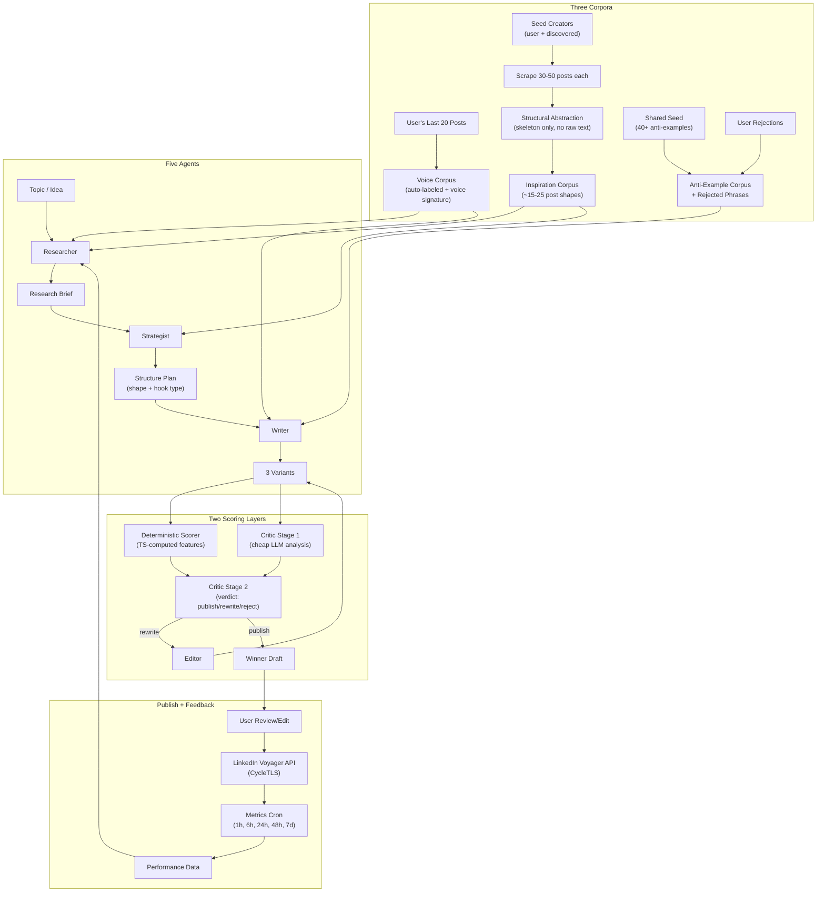

# LinkedIn Post Generator -- End-to-End System

## The Thesis

Five agents, three corpora, two scoring layers, one feedback loop.

- **Agents**: Researcher -> Strategist -> Writer -> Critic (2-stage) -> Editor
- **Corpora**: Voice corpus (user's own posts), Inspiration corpus (creators, structurally abstracted), Anti-example corpus (failure modes)
- **Scoring**: Deterministic metrics (computed in TS) + LLM rubric (judged)
- **Loop**: Generate -> Score -> Rewrite (max 3) -> Publish -> Track -> Feed back

Existing tools (Taplio, AuthoredUp) are ChatGPT wrappers with templates. They don't research real creators, don't learn your voice statistically, don't track what actually works, and don't improve over time. This system does all four.

Adapted from a single-user design for multi-tenant SaaS: manual labeling is replaced with automated GPT classification, pgvector/spaCy are replaced with MongoDB + TS-based feature extraction, and corpora are seeded shared + per-user.

---

## Architecture Overview



---

## Phase 0: Corpus Construction

### 0a. Voice Corpus (User's Own Posts)

Scrape user's last 20 posts via voyager profile activity API (session from extension).

**Auto-labeling (replaces manual 3-hour pass):** Run each post through a GPT classification prompt that outputs:
- `pillar`: mapped from user's configured content pillars / brandingSetting
- `post_type`: story / tactical / opinion / announcement / question / list
- `hook_type`: contrarian / stat / question / anecdote / callout / confession / meta
- `performance_bucket`: top-quartile / upper-mid / lower-mid / bottom-quartile (computed within pillar using engagement data from voyager)
- `voice_representative`: bool -- GPT judges "does this sound like the author at their most authentic" based on consistency with the majority of their posts (independent of performance)

This gives two overlapping sets: high-performing posts (for pattern learning) and voice-representative posts (for voice matching). Sometimes they overlap, sometimes not.

**Voice signature computation (TS-based, not spaCy):**

Computed statistically from the 20 posts using TypeScript string/regex operations:
- `avg_sentence_length`, `sentence_length_variance` (high variance = human, low variance = AI)
- `avg_paragraph_length`, `contraction_rate` (per 100 words)
- `first_person_rate`, `question_frequency` (per post)
- `emoji_count_avg`, `hashtag_usage_avg`
- `signature_vocabulary`: top 30 terms by TF-IDF vs a generic LinkedIn corpus baseline (precomputed and shared)
- `signature_phrases`: frequent bigrams/trigrams specific to this user
- `avoid_vocabulary`: words common in generic LinkedIn that this user never uses
- `opening_patterns`: how they typically start posts (first line structures)
- `closing_patterns`: how they typically end

Store as JSON on the `VoiceSignature` schema. This catches statistical patterns that GPT vibes-analysis misses. Retrieval shows "a post like you'd write"; the signature describes "the shape of your writing."

Refreshable on demand. Recompute when user adds significant new posts.

### 0b. Creator Discovery (Hybrid)

User provides 3-5 seed creators (LinkedIn profile URLs or public identifiers).

System discovers more:
- Hit LinkedIn's "People Also Viewed" voyager endpoint for each seed profile
- Search LinkedIn for profiles matching user's niche keywords with high follower counts
- Optionally: analyze who appears in seed creators' comment sections frequently

Present discovered creators to user for approval. Target: 10-15 creators total.

Selection criteria to surface to user:
- Overlap with at least one of user's content pillars
- Roughly similar audience tier (within 5x follower count)
- Explicitly flag creators whose voice is dramatically different (ultra-corporate, ultra-thread-bro) -- their structures may not transfer

Store as `CreatorProfile` schema: `publicIdentifier`, `name`, `headline`, `followerCount`, `nicheTag`, `addedBy` (user vs discovered), `profileId` (owning user), `status`, `lastScrapedAt`.

### 0c. Inspiration Corpus (Structurally Abstracted)

For each creator: scrape last 30-50 posts via voyager activity API with engagement data. Store raw posts in `CreatorPost` schema.

**The critical step -- structural abstraction extraction:**

Don't use raw posts at generation time. Run an extraction pass (cheap model) on each post to produce:

```json
{
  "structural_sequence": [
    {"section": "hook", "move": "contrarian_claim_against_common_advice", "length": "1_line"},
    {"section": "setup", "move": "personal_credibility_anchor", "length": "2_lines"},
    {"section": "body", "move": "numbered_tactical_breakdown", "length": "medium", "item_count": 4},
    {"section": "close", "move": "question_inviting_disagreement", "length": "1_line"}
  ],
  "hook_pattern": "specific_number + counterintuitive_claim",
  "rhetorical_devices": ["unexpected_specificity", "confession_before_lesson"],
  "what_makes_this_work": "2 sentences, transferable craft not topic",
  "length_bucket": "short_600 | medium_1200 | long_2000",
  "tone": "authoritative | conversational | vulnerable | playful | analytical",
  "do_not_transfer": ["specific phrases or stylistic tics tied to this creator"],
  "transferability_score": 1-5,
  "pillar_relevance": ["mapped to user's pillars"]
}
```

After extraction: the Writer never sees another creator's actual words, only structural descriptions. This is what prevents voice collapse.

**Filtering:** Drop posts with `transferability_score` < 3 (too creator-specific).

**Clustering:** Cluster the structural sequences. Expect ~15-25 distinct post "shapes" recurring across creators. These become the Strategist's vocabulary -- it picks a shape, not a post to emulate.

Store as `StructuralPattern` schema, linked to user's profile.

### 0d. Anti-Example Corpus + Rejected Phrases

**Anti-example corpus (shared seed + per-user):**

Seed with 30-50 posts exhibiting common failure modes, shared across all users:
- ChatGPT-obvious rhythm (triadic cadence, "not just X but Y")
- Generic thought-leader slop
- Engagement bait ("Comment AGREE if...")
- Performative vulnerability
- Fake-deep wisdom ("Leadership isn't about leading")
- Vague advice with no specifics

Each anti-example tagged with `failure_modes[]` and `specific_tells[]`. Used by the Critic (not the Writer) to pattern-match against drafts.

Per-user additions: every time user rejects a draft, the system offers to add it (or specific sections) to their anti-example corpus.

**Rejected phrases list (shared seed + per-user):**

Seed with ~40 phrases, shared:
- Generic AI tells: "it's not just X, it's Y", "game-changer", "unlock", "leverage", "delve", "landscape", "ever wondered", "here's the thing", "let that sink in", "plot twist", "fast-paced world", "in today's digital age"
- Engagement bait: "Comment AGREE", "Drop a fire emoji", "Thoughts?" (as filler)
- Sloppy closings: "And that's the real lesson", "Remember: X", "Stay curious", "Keep building"

Per-user: one-click "add to blacklist" in the generation workspace UI. When user rejects a draft, they can highlight the offending phrase and add it. This is the single highest-leverage taste-encoding mechanism.

Store with `pattern_type` (exact / regex / semantic), `scope` (shared / user-specific), `addedAt`, `source`.

---

## Phase 1: Five-Agent Generation Pipeline

### 1a. Schemas

New domain: `src/domains/post-generator/`

- **`GeneratedPost`**: `profileId`, `ownerId`, `topic`, `inputType`, `researcherBrief`, `strategistPlan`, `variants[]` (content, scores, critique, iteration), `selectedVariant`, `status` (draft/reviewing/scheduled/published/failed), `publishedActivityUrn`, `scheduledAt`, `publishedAt`, `researchSnapshot`, `userOverrides[]`
- **`CreatorProfile`**: creator metadata + link to owning user
- **`CreatorPost`**: raw scraped post + engagement data
- **`StructuralPattern`**: abstracted skeleton from creator posts
- **`VoiceSignature`**: computed statistical voice profile per user
- **`RejectedPhrase`**: phrase + pattern_type + scope + source
- **`AntiExample`**: post content + failure_modes + specific_tells + scope
- **`PostMetrics`**: time-series engagement snapshots per published post

### 1b. The Five Agents

**Agent 1: Researcher**

Purpose: given a raw topic/idea, produce a research brief. What's been covered, what's the gap, what angle to take.

Inputs:
- Raw topic from user
- User's last 90 days of posts (topics covered, to avoid repetition)
- Inspiration corpus semantic search on the topic (structural patterns, not raw text)
- Performance patterns from metrics ("your posts on X pillar with hook type Y perform 2x")

Outputs structured brief:
- `core_claim`: one sentence
- `pillar`: mapped to user's pillars
- `angle_options[]`: 2-3 angles with differentiation and risk
- `recommended_angle`
- `recency_check`: has user covered this recently?
- `saturation_check`: low/medium/high in the niche
- `specificity_assets`: specific numbers, names, timeframes the user should include

Model: Sonnet-class (needs reasoning).

**Agent 2: Strategist**

Purpose: pick the structural shape and hook type. Prevent shape repetition.

Inputs:
- Researcher brief
- Last 10 posts' structural shapes (anti-repetition)
- Structural pattern library (clustered shapes from inspiration corpus)
- Performance priors (which shapes work for this user)

Outputs:
- `structural_sequence[]`: section-by-section blueprint
- `hook_type`: contrarian / stat / confession / question / etc.
- `target_length_chars`, `target_paragraph_count`
- `tone_target`
- `shape_novelty_vs_recent`: high/medium/low
- `justification`

Model: Sonnet-class.

**Agent 3: Writer**

Purpose: generate 3 variants executing the strategy in the user's voice.

Inputs:
- Researcher brief + Strategist structure
- Voice corpus chunks (top 5, pillar-filtered, voice-representative-filtered)
- Voice signature JSON
- Rejected phrases list

Rules:
- Match voice signature statistically (sentence length variance, diction, rhythm)
- Follow structural sequence from Strategist exactly
- Never use any phrase from rejected list
- Be specific (use specificity_assets from Researcher)
- 3 variants with different hooks from the Strategist's hook_type family

Model: Sonnet or Opus (highest quality delta here).

**Agent 4: Critic (2-stage)**

Stage 1 (cheap, analytical -- runs on each variant):
- Compute deterministic features (see 1c below)
- Run cheap LLM analysis: voice match check, anti-example pattern matching, dimension-by-dimension breakdown with specific phrase citations
- Input: draft + voice signature + anti-example corpus + deterministic scores

Stage 2 (expensive, judgment -- runs on Stage 1 output):
- Hard-fail conditions (auto-reject): contains rejected phrase, voice match < threshold, matches 2+ anti-example failure modes
- "Would this user publish this?" taste judgment
- Decision: publish / rewrite / reject
- If rewrite: prioritize top 2 issues only (not all issues)
- `rewrite_effort`: low / medium / high

Model: Stage 1 = cheap model (gpt-4o-mini equivalent). Stage 2 = Sonnet.

**Agent 5: Editor**

Purpose: constrained rewrite addressing only the top 2 issues from Critic.

Rules:
- Fix only what the Critic flagged
- Don't touch anything else
- Preserve voice signature
- If `rewrite_effort` = high, refuse and kick back to Writer for full re-generation

Model: Sonnet.

### 1c. Two Scoring Layers

**Layer 1: Deterministic features (TS-computed, no Python deps)**

Computed on every draft and stored:
- Length: char_count, word_count, paragraph_count, avg_paragraph_length, line_break_count
- Structure: hook_length_chars (first line), has_numbered_list, has_bulleted_list, hashtag_count, emoji_count, question_count
- Specificity: number_count (specific numbers in text), proper_noun_count, specific_timeframe_count ("last Tuesday", "3 weeks ago") -- proxy for concreteness
- Readability: avg_sentence_length, sentence_length_variance
- Voice deltas: contraction_rate vs user baseline, first_person_rate vs baseline, signature_vocab_overlap, avoid_vocab_hits
- Pattern flags: rejected_phrase_hits (exact + regex match), triadic_rhythm_count

Calibrated against user's own corpus: raw features converted to 1-5 scores using percentile buckets from the user's voice corpus. A specificity_score of 4 means "more specific than 60% of YOUR posts" -- meaningful. "More specific than generic LinkedIn" is not.

**Layer 2: LLM rubric (judged)**

Dimensions scored 1-10 by the Critic:
- Hook strength: would you stop scrolling?
- Authenticity: does this sound human and like THIS user?
- Value density: real insight or repackaged common knowledge?
- Engagement trigger: does this invite responses, disagreement, sharing?
- Readability: scannable, mobile-friendly structure?
- Voice match: consistent with user's signature?

Every dimension requires citing the specific phrase/section that drove the score. No "feels generic" without pointing to the exact line.

### 1d. Orchestration

Per generation request:

1. Researcher produces brief (topic + context -> scoped angle)
2. Strategist picks structure (brief + pattern library -> blueprint)
3. Writer generates 3 variants (brief + structure + voice corpus + rejected phrases -> 3 drafts)
4. For each variant, up to 3 rounds:
   - Compute deterministic features
   - Critic Stage 1 (cheap analysis)
   - Critic Stage 2 (verdict: publish / rewrite / reject)
   - If rewrite + effort low/medium: Editor fixes top 2 issues
   - If rewrite + effort high: back to Writer
   - If reject: move to next variant
   - If publish: candidate found
5. Pick winner (highest weighted score among "publish" candidates)
6. If no publishable candidate: return best effort with flag for user

Every iteration logged. Every decision logged. This is training data for improving prompts.

### 1e. Publishing

Mirror `comment.util.ts` CycleTLS pattern for LinkedIn's share/create-post voyager endpoint:
- Build request body for `com.linkedin.voyager.dash.feed.update.CreateShareAction`
- Post via CycleTLS with user's session credentials
- Return `activityUrn` for metrics tracking
- Handle 401 -> mark profile unauthorized (same as commenting)
- Schedule via Bull queue (same pattern as comment-scheduler)

---

## Phase 2: Metrics Feedback Loop (the Outer Loop)

### 2a. Metrics Collection

**Schema: `PostMetrics`** -- time-series snapshots:
- `generatedPostId`, `activityUrn`, `profileId`
- `snapshots[]`: `{ timestamp, impressions, reactions, reactionBreakdown, comments, reposts }`
- Collection at: 1h, 6h, 24h, 48h, 7d after publish
- Normalize engagement rate within pillar (not overall)

Cron via Bull queue: scrape LinkedIn's `socialDetail` + analytics voyager endpoints. Reuse CycleTLS.

### 2b. Feedback Integration

Three signals fed back into generation:
1. **Performance priors for Strategist**: "shape X performs at Y percentile for you"
2. **Top/bottom examples for Researcher**: "your top 3 shared [pattern], your bottom 3 lacked [pattern]"
3. **Voice corpus updates**: new published posts auto-added, re-label, recompute signature

**Override tracking (highest-signal training data):**
- When user heavily edits a draft the Critic approved -> log the delta, what did the system miss?
- When user publishes what the Critic rejected -> what rubric dimension was wrong?
- Weekly: surface overrides for prompt tuning. These are worth more than 100 normal examples.

---

## Phase 3: Dashboard UI

### 3a. Agent Type Registration

Register `linkedin-post-generator` in `AGENT_TYPES`:

**Onboarding flow:**
1. Connect LinkedIn profile (existing extension flow)
2. Brand extraction: scrape posts -> show extracted voice profile for user confirmation ("Here's how you write: conversational, lots of questions, short paragraphs...")
3. Creator input: user provides 3-5 creators -> system discovers more -> user approves list
4. System runs initial corpus construction (background job, ~2-5 min)

**Settings:**
- Content pillars / topics
- Creator list management (add/remove/re-scrape)
- Posting frequency target
- Rejected phrases management (view list, add, remove)
- Voice profile (view, refresh, manual adjustments)
- Scheduling windows

### 3b. Generation Workspace

- Topic input (freeform text, idea, article URL to repurpose)
- "Generate" with progress steps visible (Researching... Strategizing... Writing... Scoring...)
- 3 variant cards with: full text, score breakdown (deterministic + rubric), critique summary
- Recommended variant highlighted
- Inline edit
- **One-click "blacklist phrase"**: highlight any text in a variant, click to add to rejected phrases
- Schedule picker or "Publish Now"
- History of past generations

### 3c. Metrics + Insights Dashboard

- Per-post performance timeline (impressions, reactions, comments, reposts at each snapshot)
- Trend charts (Recharts): engagement over time, by pillar, by post shape
- "What's working" auto-summary: GPT-generated insight from top-performing posts
- Creator benchmark: your average engagement vs tracked creators' averages
- Override log: posts where you disagreed with the system (for your own review)

---

## What's NOT in Scope

- No LightGBM engagement predictor (insufficient data per user, deterministic features + LLM rubric are enough)
- No pgvector / embedding search (MongoDB + GPT relevance ranking for the volume we handle)
- No spaCy / Python NLP (all feature extraction in TypeScript)
- No manual labeling (GPT auto-labels, users don't spend 3 hours tagging posts)
- No carousel / image / document generation (text posts only)
- No multi-platform (LinkedIn only in V1)
- No A/B testing (one post, one version -- the outer loop IS the experiment)
- No real-time trending topic analysis

---

## Key Reuse from Existing Codebase

- `comment.util.ts` CycleTLS pattern -> post publishing + creator scraping + metrics scraping
- `GptService` (Azure OpenAI) -> all 5 agents + corpus extraction
- `Profile` credentials (li_at, CSRF, JA3, proxy) -> all LinkedIn API calls
- Voyager API patterns from `post-scraper` domain -> scrape user posts, creator posts, metrics
- `AGENT_TYPES` registry -> new agent type
- `Setting.brandingSetting` -> initial voice seed before full extraction
- Bull queues -> publishing scheduler + metrics cron + corpus construction jobs
- `comment-scheduler` patterns -> post scheduling

---

## Build Order

1. **Phase 0** (Corpora) -- the foundation. Nothing generates well without voice corpus, inspiration patterns, and anti-examples.
2. **Phase 1** (Agents + Pipeline) -- the core product. Generates, scores, publishes.
3. **Phase 2** (Metrics) -- closes the outer loop. The long-term moat.
4. **Phase 3** (Dashboard) -- built incrementally alongside each backend phase.
