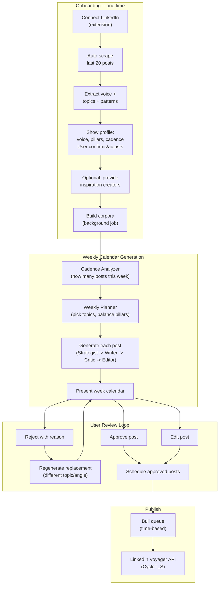
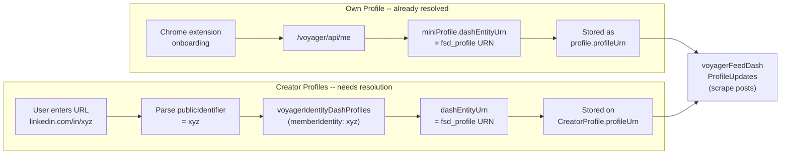

# LinkedIn Post Generator -- Phased Implementation

## System Summary

Content-calendar-first approach. System analyzes the user's profile, determines how often they should post, picks topics across their pillars, generates a full week of posts, and lets them approve/reject/edit before scheduling.

- **Agents**: Weekly Planner -> (per post) Strategist -> Writer -> Critic (2-stage) -> Editor
- **Corpora**: Voice corpus (user's own), Inspiration corpus (creators, structurally abstracted), Anti-example corpus (failure modes)
- **Scoring**: Deterministic features (TS-computed) + LLM rubric (judged)
- **Calendar loop**: Plan week -> Generate all posts -> User reviews -> Reject with reason -> Regenerate replacements -> Approve -> Schedule
- **Outer loop** (Phase 2): Publish -> Track metrics -> Feed back into next week's planning

---

## The UX Flow



---

## Phase 1: Full Calendar Generator with Publishing (~7-9 weeks)

### Model Assignment (All Azure OpenAI)

Four model tiers, each chosen for what the step actually needs:

| Agent / Step | Model | Why this model |
|---|---|---|
| Auto-labeling (voice corpus) | **gpt-5.4-nano** | Classification at volume, fast, cheapest GPT-5 family model |
| Structural abstraction (inspiration) | **gpt-5.4-nano** | Structured extraction at volume (300-500 posts) |
| Cadence analysis | **gpt-5.4-pro** | One-time deep reasoning about profile, niche, audience -- Pro's extended thinking earns its cost here |
| Weekly Planner | **gpt-5.4-pro** | Most complex reasoning step: balance N constraints (pillars, freshness, variety, shapes, timing) across 5-7 slots simultaneously |
| Strategist (per post) | **gpt-5.4** | Moderate reasoning, pick structure from pattern library -- standard 5.4 is plenty |
| Writer (per post) | **gpt-5.4** | Best creative quality + output stability for voice matching. Pro over-thinks prose; 5.4 writes more naturally |
| Critic Stage 1 (per post) | **gpt-5.4-nano** | Analytical checklist, pattern matching, deterministic scoring assist |
| Critic Stage 2 (per post) | **gpt-5.4-pro** | The "would this user publish this?" taste judgment. Pro's reasoning depth catches nuance that cheaper models miss |
| Editor (per post) | **gpt-5.4** | Surgical rewrite needs craft, not deep reasoning. Same quality bar as Writer |
| Rejection re-plan | **gpt-5.4-pro** | Must reason about rejection reason + remaining calendar balance + what went wrong. Targeted, high impact |

Config in `gpt.config.ts`:
- `postGenNanoModel`: **gpt-5.4-nano** -- classification, extraction, analytical checklists
- `postGenStandardModel`: **gpt-5.4** -- creative writing, strategic structure, editing
- `postGenProModel`: **gpt-5.4-pro** -- deep reasoning, planning, taste judgment

### 1A. Corpus Construction (Backend) -- ~2-3 weeks

**Voice Corpus:**
- Scrape user's last 20 LinkedIn posts via `voyagerFeedDashProfileUpdates` using `profile.profileUrn` (the `fsd_profile` URN already stored in DB from extension onboarding -- extracted from `/voyager/api/me` -> `miniProfile.dashEntityUrn`)
- Auto-label each post with GPT: pillar, post_type, hook_type, performance_bucket, voice_representative
- Compute voice signature in TypeScript: sentence length stats, contraction rate, question frequency, signature vocabulary (TF-IDF vs generic baseline), opening/closing patterns, avoid vocabulary
- Store as `VoiceSignature` schema, linked to profile
- Fallback for new users with few/no posts: extract voice from About section + headline + brandingSetting, use generic structural patterns until they build history

**Profile Analysis + Cadence Determination:**
- Analyze profile using **gpt-5.4-pro**: follower count, niche competitiveness, current posting frequency, engagement per post, audience size, content type
- Output: recommended posts_per_week (e.g., 3 for a 5K-follower profile building presence, 5-7 for a 50K+ thought leader)
- User can override, but system provides the reasoning
- Also determines optimal posting days/times based on their engagement patterns

**Creator Discovery (Optional, from onboarding):**
- User provides LinkedIn URLs (e.g., `linkedin.com/in/williamhgates`) during onboarding
- **URN resolution step**: parse `publicIdentifier` from URL -> call `voyagerIdentityDashProfiles` with `(memberIdentity:{publicIdentifier})` -> extract `dashEntityUrn` (the `fsd_profile` URN). This URN is required for all subsequent scraping via `voyagerFeedDashProfileUpdates`.
- Store both `publicIdentifier` and resolved `profileUrn` on `CreatorProfile` schema
- Discover similar creators via "People Also Viewed" (returns `fsd_profile` URNs directly in the response)
- If user skips: system works with voice corpus + shared structural patterns only (still functional, just less niche-informed)
- Target: 10-15 creators if provided

**Inspiration Corpus (Structural Abstraction):**
- Scrape each creator's last 30-50 posts with engagement data
- Run structural abstraction extraction: skeleton of rhetorical moves, hook patterns, transferability score, do-not-transfer phrases
- Filter: drop transferability_score < 3
- Cluster into ~15-25 reusable post shapes
- The Writer never sees raw creator text -- only structural descriptions

**Anti-Example Corpus + Rejected Phrases:**
- Seed shared set: 30-50 anti-example posts with tagged failure modes + ~40 rejected phrases
- Store as `AntiExample` and `RejectedPhrase` schemas with scope (shared/user-specific)

### 1B. Agent Pipeline (Backend) -- ~2-3 weeks

The pipeline has two levels: **weekly planning** (runs once to plan the calendar) and **per-post generation** (runs for each slot in the calendar).

**Weekly Planner (new -- replaces per-topic Researcher):**
- Input: user's content pillars, voice corpus (what they've written about), posting cadence (from profile analysis), last 2-3 weeks of published/generated posts (anti-repetition), inspiration corpus patterns, optional user-seeded ideas
- Uses **gpt-5.4-pro** to plan the entire week:
  - Pick N topics (where N = posts_per_week from cadence analysis)
  - Balance across pillars (don't post 5 SaaS posts and 0 leadership posts)
  - Ensure topic freshness (not covered in last 3 weeks)
  - Vary the emotional register across the week (not 5 hot takes in a row)
  - Assign a preliminary hook_type and post_shape to each slot for variety
  - Pick optimal day/time for each post based on content type and audience patterns
- Output: `WeeklyPlan` with N slots, each containing: `topic`, `angle`, `pillar`, `suggested_shape`, `suggested_hook_type`, `scheduled_day`, `scheduled_time`, `reasoning`
- Model: **gpt-5.4-pro**

**Per-Post Pipeline (for each calendar slot):**

**Strategist:**
- Input: this slot's topic/angle from Weekly Planner + pattern library + recent posts' shapes (for local anti-repetition)
- Output: concrete structural_sequence, hook_type, target_length, tone_target
- Model: **gpt-5.4**

**Writer:**
- Input: slot's topic + Strategist structure + voice corpus chunks (pillar-filtered, voice-representative) + voice signature + rejected phrases
- Output: 1 post (not 3 variants -- the calendar already has N posts to review)
- Must follow structure exactly, match voice signature, never use rejected phrases
- Model: **gpt-5.4**

**Critic (2-stage):**
- Stage 1 (**gpt-5.4-nano**): deterministic features + LLM analysis (voice match, anti-example check, dimension-by-dimension with phrase citations)
- Stage 2 (**gpt-5.4-pro**): verdict -- pass / rewrite / fail. Hard-fail on rejected phrases, low voice match, 2+ anti-example matches
- If rewrite: Editor fixes top 2 issues. Max 3 rounds total.
- If fail after 3 rounds: flag slot as "needs manual attention" in calendar

**Editor:**
- Fix only flagged issues, preserve voice, don't touch anything else
- If effort=high, kick back to Writer for full re-generation
- Model: **gpt-5.4** (same quality bar as Writer)

**Two Scoring Layers:**
- Deterministic (TS): length metrics, structure detection, specificity proxies, readability, voice delta, rejected phrase hits. Calibrated as 1-5 against user's own corpus.
- LLM rubric: hook strength, authenticity, value density, engagement trigger, readability, voice match. Each must cite specific phrases.

### 1C. Rejection + Regeneration (Backend) -- ~1 week

When a user rejects a post from the calendar:
- Capture rejection reason (freeform text: "too similar to last week", "not feeling this topic", "too generic", etc.)
- System generates a replacement:
  - Weekly Planner re-runs for just this one slot, with constraints: avoid the rejected topic/angle, respect the reason, maintain pillar balance with the rest of the week
  - New topic goes through the full per-post pipeline (Strategist -> Writer -> Critic -> Editor)
  - Replacement appears in the same calendar slot
- Rejection data stored for Phase 2 feedback (what topics/angles does this user consistently reject?)

### 1D. Publishing + Scheduling (Backend) -- ~1 week

- `publish.util.ts`: mirror `comment.util.ts` CycleTLS pattern for LinkedIn's `voyagerContentcreationDashShares` GraphQL mutation endpoint
- When user approves a calendar post: set status to `scheduled`, Bull queue picks it up at the planned time
- Bulk approve: "Schedule all approved" button schedules the entire week
- Handle 401 -> mark profile unauthorized
- On successful publish: store `activityUrn` on the post (needed for Phase 2 metrics)

### 1E. Schemas (Backend) -- parallel with above

New schemas in `src/domains/post-generator/`:

- **`ContentCalendar`**: `profileId`, `ownerId`, `weekStartDate`, `cadence` (posts_per_week), `status` (generating/reviewing/scheduled/completed), `weeklyPlan` (Planner output snapshot)
- **`CalendarPost`**: `calendarId`, `profileId`, `ownerId`, `slotIndex`, `topic`, `angle`, `pillar`, `scheduledDay`, `scheduledTime`, `content`, `scores` (deterministic + rubric), `critiqueHistory[]`, `status` (generating/ready/approved/rejected/scheduled/published/failed), `rejectionReason`, `replacedPostId`, `publishedActivityUrn`, `strategistOutput`, `researchSnapshot`
- **`CreatorProfile`**: `publicIdentifier` (from URL), `profileUrn` (resolved `fsd_profile` URN), `firstName`, `lastName`, `headline`, `followerCount`, `discoverySource` (user-provided / people-also-viewed), `ownerProfileId`, `ownerId`, `lastScrapedAt`
- **`CreatorPost`**: raw scraped post + engagement (archived)
- **`StructuralPattern`**: abstracted skeleton, cluster assignment
- **`VoiceSignature`**: computed statistical voice profile
- **`RejectedPhrase`**: phrase, pattern_type, scope, source
- **`AntiExample`**: post content, failure_modes, specific_tells, scope

Controller endpoints:
- `POST /post-generator/calendar/generate` -- generate a new week's calendar
- `GET /post-generator/calendar/:id` -- get calendar with all posts
- `GET /post-generator/calendar/current` -- get current/latest calendar
- `PATCH /post-generator/calendar/:calendarId/post/:postId/approve` -- approve a post
- `PATCH /post-generator/calendar/:calendarId/post/:postId/edit` -- edit post content
- `POST /post-generator/calendar/:calendarId/post/:postId/reject` -- reject with reason, triggers regeneration
- `POST /post-generator/calendar/:calendarId/schedule-all` -- bulk schedule all approved posts
- `POST /post-generator/calendar/:calendarId/post/:postId/publish` -- publish one post immediately
- `GET /post-generator/calendar/history` -- past calendars

### 1F. Dashboard (Frontend) -- ~2-3 weeks

The post generator is a **new agent type** (`linkedin-posting`) in the existing agent system. Users add it via the Agent Hub "Add Agent" dialog, which triggers its own onboarding flow. Once set up, it lives alongside commenting agents in the hub but uses a completely different layout (calendar-based instead of queue/stats/settings tabs).

**Agent Registration:**
- New entry in `registry.ts` under `AGENT_TYPES['linkedin-posting']` with its own `AgentTypeDefinition`
- The existing `AgentTypeDefinition` interface needs extension -- the current shape assumes commenting agents (it has `scrapeSettingsComponent`, `commentSettingsComponent`, `queueColumns`, `queueItemComponent`). The post generator needs none of these. Options:
  - Add an optional `layoutComponent` override to `AgentTypeDefinition` that replaces the default `AgentLayout` (which renders Stats/Queue/Settings tabs). When present, it takes over the entire agent view.
  - The `linkedin-posting` agent uses this to render its own calendar-based layout instead of the commenting agent's queue/stats/settings tabs.
- Update `use-current-agent.ts` to remove the hardcoded `expectedType = platform === 'twitter' ? 'twitter-commenting' : 'linkedin-commenting'` logic -- a profile should be able to have multiple agent types.
- The routing at `/_authenticated/agents/$profileId/$agentType/` already supports this since `$agentType` is dynamic.

**Existing onboarding flow -- NO CHANGES:**
The current sign-up onboarding (extension -> agent type -> connect account -> post/comment settings) stays exactly as-is. It handles first-time user setup for commenting agents.

**Add Agent flow (for existing users adding `linkedin-posting`):**
User clicks "Add Agent" in Agent Hub -> selects `linkedin-posting` from the list -> the dialog checks if they already have a connected LinkedIn profile:
- **If yes** (they already set up a commenting agent): skip the connect step, proceed directly to the post-generator setup wizard.
- **If no**: show the "Connect LinkedIn" step in the dialog (same as current Add Agent Dialog behavior), then proceed to the post-generator setup wizard.

**Post Generator Setup Wizard (shown inside Add Agent flow, not in global onboarding):**
This is a multi-step wizard specific to the `linkedin-posting` agent, triggered from the Add Agent Dialog after a LinkedIn profile is connected:
1. "Analyzing your LinkedIn presence..." -- scrape last 20 posts, extract voice + topics (show loading with progress)
2. **Voice confirmation screen**: "Here's how you write:" -- show extracted voice traits (tone, style, patterns). "Continue in this voice?" with option to adjust
3. **Inspiration screen** (optional): "Any creators you admire in your space?" -- input 3-5 LinkedIn URLs, or skip. If provided, show discovered similar creators for approval
4. **Interest/pillar confirmation**: "Based on your posts, you write about:" -- show extracted pillars with ability to add/remove/rename. Confirm.
5. **Cadence recommendation**: "Based on your profile, we recommend X posts/week." -- show reasoning, allow override
6. "Generating your first content calendar..." -- background job builds corpora + generates week
7. Land on calendar view

**Content Calendar (the primary view for this agent -- replaces queue/stats/settings):**
- Week view: 7 columns (Mon-Sun), posts placed in their scheduled slots
- Each post card shows: pillar tag, topic/angle, first 2-3 lines preview, score badge, status (ready/approved/scheduled/published)
- Expand a post: full text, score breakdown, edit capability
- **Approve**: green checkmark, post moves to "approved" state
- **Edit**: inline edit mode, save updates the post
- **Reject**: red X, prompts for reason (freeform text input with suggested quick-reasons: "Topic doesn't feel right", "Too similar to recent posts", "Not my style", "Too generic", custom). System generates replacement in the same slot.
- **Bulk actions**: "Approve All", "Schedule All Approved"
- **Generate Next Week**: button to create next week's calendar (available once current week is mostly approved/scheduled)
- Empty slots visible if cadence < 7 (e.g., 3 posts/week shows posts on Mon/Wed/Fri, other days empty)

**Settings (accessible from calendar view, not as a separate tab):**
- Content pillars / topics (add, remove, rename)
- Creator list management (add/remove creators, re-scrape)
- Cadence override (change posts/week)
- Voice profile (view signature stats, refresh from latest posts)
- Scheduling preferences (preferred days/times, timezone)
- Rejected phrases (view, manually add, remove)

**History (accessible from calendar view):**
- Past calendars (week by week)
- View each week's posts, statuses, rejection history

---

## Phase 2: The Learning Loop (~3-4 weeks)

Everything that makes the system get smarter week over week. Phase 1 generates good calendars. Phase 2 makes each week's calendar better than the last.

### 2A. Metrics Collection (Backend) -- ~1-2 weeks

**`PostMetrics` schema:**
- `calendarPostId`, `activityUrn`, `profileId`
- `snapshots[]`: `{ timestamp, impressions, reactions, reactionBreakdown, comments, reposts }`

**Cron job via Bull queue:**
- For each published post within 7-day window, scrape LinkedIn's `socialDetail` + analytics voyager endpoints
- Collection intervals: 1h, 6h, 24h, 48h, 7d after publish
- Normalize engagement rate within pillar
- Reuse CycleTLS infrastructure

### 2B. Feedback Integration (Backend) -- ~1 week

**Into Weekly Planner:**
- "Last week, your [pillar] posts got 2x the engagement of [other pillar]. Consider increasing [pillar] frequency."
- "Story-format posts outperform listicles for your audience by 40%."
- "Tuesday and Thursday posts get highest engagement for your profile."
- Cadence adjustment: if engagement is declining, suggest fewer higher-quality posts. If growing, suggest maintaining or increasing.

**Into Strategist:**
- Performance priors per shape: "contrarian hook + numbered breakdown performs at 80th percentile for you"
- Shape fatigue: "you've used story-arc 3 weeks in a row, try something different"

**Rejection pattern analysis:**
- Track what users consistently reject (topics, angles, styles)
- Feed back into Weekly Planner as negative constraints: "user frequently rejects [pattern], deprioritize"

**Voice corpus growth:**
- Newly published posts auto-added to voice corpus
- Re-label, recompute signature (batch, not real-time)

### 2C. Per-User Taste Encoding -- ~1 week

- **One-click rejected phrase blacklist**: in calendar post view, highlight text -> add to blacklist
- Per-user anti-example additions: when user rejects a draft, offer to add it to their anti-examples
- Rejection reasons aggregated and surfaced as system learning: "You tend to reject [X type] posts. We've adjusted."

### 2D. Metrics Dashboard (Frontend) -- ~1-2 weeks

- Per-post performance timeline (snapshots visualized)
- Weekly trend: this week vs last week vs last month
- Pillar performance: which content pillars drive the most engagement
- Shape/hook performance: which structural patterns work best
- "What's working" auto-summary: GPT-generated weekly insight
- Creator benchmark: your engagement vs tracked creators
- Rejection history + what the system learned from it

---

## What's NOT in Scope (Either Phase)

- No LightGBM engagement predictor (deterministic features + LLM rubric suffice)
- No pgvector / embedding search (MongoDB + GPT relevance for this volume)
- No spaCy / Python NLP (all features in TypeScript)
- No manual labeling (GPT auto-labels)
- No carousel / image / document posts (text only)
- No multi-platform (LinkedIn only)
- No A/B testing
- No user-provided topics required (system picks, but user can suggest via pillar adjustment)

---

## Key Reuse from Existing Codebase

- `comment.util.ts` CycleTLS pattern -> publishing + creator scraping + metrics scraping
- `GptService` (Azure OpenAI) -> all agents + corpus extraction
- `Profile` credentials (li_at, CSRF, JA3, proxy) -> all LinkedIn API calls
- Voyager API patterns from `post-scraper` -> scrape user posts, creator posts, metrics
- `AGENT_TYPES` registry -> new agent type
- `Setting.brandingSetting` -> initial voice/pillar seed
- Bull queues -> calendar generation + publishing scheduler + corpus construction + metrics cron
- `comment-scheduler` patterns -> post scheduling

---

## LinkedIn API Reference (Verified May 2026 via Live Browser Inspection)

LinkedIn still uses the **Voyager API** (with GraphQL query IDs) for all data operations. The new SDUI/RSC layer (`/flagship-web/rsc-action/`) is a rendering-only wrapper for profile pages and is NOT needed for data access.

### URN Resolution Flow

All scraping APIs require an `fsd_profile` URN. Here's how we get it for each case:



### Scraping APIs (GET, via CycleTLS)

**Own profile posts** (voice corpus):
```
GET /voyager/api/graphql
  ?includeWebMetadata=true
  &variables=(count:20,start:0,profileUrn:urn%3Ali%3Afsd_profile%3A{memberUrn})
  &queryId=voyagerFeedDashProfileUpdates.4af00b28d60ed0f1488018948daad822
```
- Returns `included[]` with typed objects
- `com.linkedin.voyager.dash.feed.Update`: post content via `commentary.text.text`, `entityUrn` (activity URN), `actor`, `metadata.shareAudience`
- `com.linkedin.voyager.dash.feed.SocialActivityCounts`: `numLikes`, `numComments`, `numShares`, `numImpressions`, `reactionTypeCounts[]`
- Supports pagination via `paginationToken` in response metadata
- Same endpoint works for any profile's posts (creator scraping)

**Search posts** (existing, still works):
```
GET /voyager/api/graphql
  ?variables=(start:0,origin:GLOBAL_SEARCH_HEADER,query:(keywords:{keyword},flagshipSearchIntent:SEARCH_SRP,queryParameters:List(...)),count:20)
  &queryId=voyagerSearchDashClusters.{dynamicQueryId}
```
- `queryId` hash rotates; extract dynamically via `getSearchPostsQueryIdUsingCycleTls` (existing pattern)

**Profile identity** (resolve publicIdentifier -> fsd_profile URN for creator discovery):
```
GET /voyager/api/graphql
  ?includeWebMetadata=true
  &variables=(memberIdentity:{publicIdentifier})
  &queryId=voyagerIdentityDashProfiles.b5c27c04968c409fc0ed3546575b9b7a
```
- Input: `publicIdentifier` parsed from LinkedIn URL (e.g., "williamhgates" from `linkedin.com/in/williamhgates`)
- Returns `dashEntityUrn` = `urn:li:fsd_profile:ACoAAA...` needed for all other APIs
- For the user's own profile, this URN is already stored as `profile.profileUrn` (captured during extension onboarding via `/voyager/api/me`)
- For creators, this is the lookup step that bridges "user enters a URL" to "system can scrape their posts"

**Creator dashboard / stats** (existing):
```
GET /voyager/api/graphql
  ?includeWebMetadata=true
  &queryId=voyagerFeedDashCreatorExperienceDashboard.6fcd24af6f10cdcd1cd7d8e747df3276
```

### Post Creation API (POST, via CycleTLS)

**Step 1 -- Initialize sharebox** (optional but mirrors browser flow):
```
POST /voyager/api/graphql?action=execute&queryId=voyagerContentcreationDashSharebox.6065bbd24f145384527c50bfc0c387ed
Body: {"variables":{"origin":"FEED"},"queryId":"voyagerContentcreationDashSharebox.6065bbd24f145384527c50bfc0c387ed","includeWebMetadata":true}
```

**Step 2 -- Create the share (publish the post)**:
```
POST /voyager/api/graphql?action=execute&queryId=voyagerContentcreationDashShares.279996efa5064c01775d5aff003d9377
Body: {
  "variables": {
    "post": {
      "allowedCommentersScope": "ALL",
      "intendedShareLifeCycleState": "PUBLISHED",
      "origin": "FEED",
      "visibilityDataUnion": { "visibilityType": "ANYONE" },
      "commentary": {
        "text": "<post content here>",
        "attributesV2": []
      }
    }
  },
  "queryId": "voyagerContentcreationDashShares.279996efa5064c01775d5aff003d9377",
  "includeWebMetadata": true
}
```
- Response includes `resourceKey: "urn:li:fsd_share:urn:li:share:{shareId}"` and the `activityUrn`
- This is the GraphQL mutation equivalent of what was previously a REST POST to `/voyagerSocialDashNormShares`

### Required Headers (All APIs)

```
csrf-token: ajax:{csrfToken}
accept: application/vnd.linkedin.normalized+json+2.1
content-type: application/json; charset=UTF-8
x-restli-protocol-version: 2.0.0
x-li-lang: en_US
x-li-track: {"clientVersion":"1.13.44203","mpVersion":"1.13.44203","osName":"web","timezoneOffset":5.5,"timezone":"Asia/Calcutta","deviceFormFactor":"DESKTOP","mpName":"voyager-web","displayDensity":2,"displayWidth":2880,"displayHeight":1800}
x-li-page-instance: urn:li:page:d_flagship3_feed;{uuid}
x-li-pem-metadata: Voyager - Sharing - CreateShare=sharing-create-content  (for post creation)
```

### Metrics APIs (Phase 2)

Per-post engagement: use the same `voyagerFeedDashProfileUpdates` API to re-scrape published posts -- `SocialActivityCounts` in `included[]` gives `numLikes`, `numComments`, `numShares`, `numImpressions`, `reactionTypeCounts[]`.

Creator dashboard: `voyagerFeedDashCreatorExperienceDashboard` (already used in `li-stats`).

Premium analytics: `voyagerPremiumDashAnalyticsView` and `voyagerPremiumDashLibraView` (already in codebase, requires Premium).

### Key Notes

- The `queryId` hashes (e.g., `4af00b28d60ed0f1488018948daad822`) are stable enough for months but may rotate. For critical endpoints, use the existing dynamic extraction pattern.
- `clientVersion` in `x-li-track` should stay current (currently `1.13.44203` for REST endpoints, `0.2.5529` for SDUI). Use the REST format for CycleTLS.
- `included[]` response format is unchanged from existing `extractDataFromSearchResults` parser pattern in `scrape.executor.ts`. The same parsing logic applies to profile updates.
